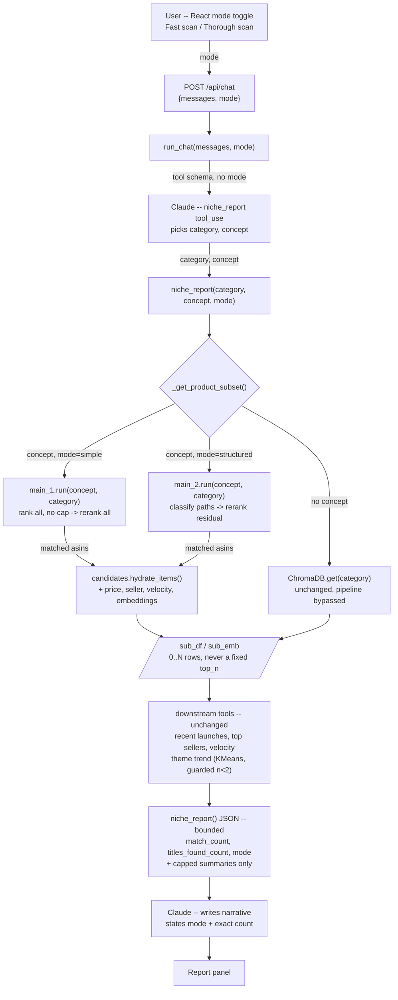

## Amazon Seller Research Assistant — ML End-to-End Project

## Project Overview

Amazon Seller Research Assistant is an AI-powered tool that helps third-party Amazon sellers research niches before launching a product. It's built as a **multi-agent system**: a Claude-powered market research agent (`chat_engine.py`) synthesizes a structured report, backed by a second set of cooperating agents (`orchestrator_agent.py` + `classify_agent.py`/`reranker.py` in `src/retrieval_pipeline/`) that handle the "how many X" / "find every X" counting logic the report depends on. The user picks between two retrieval agents per query — a fast/cheap one and a slower/more precise one (see "Retrieval Mode Selection" below) — and the report states the exact count and which one produced it, never a fixed number. The dataset covers 61,635 product launches from 2024–2026. The project follows ML engineering best practices with modular pipelines, containerization, Google Cloud deployment, and a two-service architecture separating the Flask API from the React frontend.

The retrieval pipeline (`src/retrieval_pipeline/` and `evaluator/`) was built to fix and benchmark the counting logic, then wired into `chat_engine.py` — see "Retrieval Mode Selection" below for how the two approaches are exposed to users and what changed downstream.

## Architecture

The codebase is organized into distinct pipelines following the flow:
`Ingest → Preprocess → Retrieve/Serve (report agent) → Evaluate (retrieval benchmarking)`

### Core Modules

- **`src/agent_pipeline/`**: Claude-powered niche research agent
  - `chat_engine.py`: Sends conversation history + tool schema to Claude; on `tool_use`, runs `niche_report()` locally, sends the result back to Claude for narrative generation. For a concept-narrowed query, product retrieval is delegated to `src/retrieval_pipeline/`'s `main_1`/`main_2` (see "Retrieval Mode Selection" below) instead of a capped ChromaDB query -- the matched set can honestly be 0 to several thousand items, not a fixed `top_n`. Broad category browsing (no concept) still fetches the whole category directly from ChromaDB. `_get_theme_trend()`'s KMeans clustering runs on whatever set comes back, top sellers/recent launches/review velocity are unchanged.

- **`src/retrieval_pipeline/`**: A multi-agent system with two competing pipeline configurations for "how many X" / "find every X" queries, benchmarked against each other -- see `docs/retrieval_pipeline.md` for the full write-up (diagrams, file-by-file responsibilities)
  - `main_1.py` ("simple"): `orchestrator_agent` picks 1-2 root categories (1 LLM call) → vector-rank every item in them (no cap) → cross-encoder rerank, keep `score > 0`
  - `main_2.py` ("structured"): `orchestrator_agent` picks categories → `classify_agent` scores every real `category_path` under each into confident/ambiguous/not_match (LLM) → confident paths trusted outright, only the ambiguous residual gets reranked -- two cooperating agents in sequence, each with a distinct, narrow job
  - `orchestrator_agent.py` / `classify_agent.py`: the two LLM-calling agents, shared by both mains -- `classify_agent.py`'s prompt design draws on `docs/category_tree.md`, a raw dump of Amazon's real Keepa `categoryTree` per category
  - `reranker.py`: cross-encoder (`ms-marco-MiniLM-L-6-v2`) title scorer, `score > 0` = match
  - `candidates.py`: shared ChromaDB retrieval helpers (vector-rank for main_1, exact category_path filter for main_2) plus `hydrate_items()`, which fetches full product metadata + embeddings for a matched-asin set -- `main_1`/`main_2`'s own output only carries asin/title/cat/category_path, not the price/seller/velocity/embeddings `chat_engine.py`'s downstream tools need
  - `build_chroma.py`: Embeds product titles with `all-MiniLM-L6-v2` and stores them in ChromaDB
  - `llm_client.py`: Shared DeepSeek client wrapped once for LangSmith tracing, plus a token-usage/cost accumulator both mains read after a run

- **`src/offline/`**: Retrain/offline tooling -- real, runnable code, but nothing on it is called from the live request path (`main.py` never imports it). Separated from the live-serving packages above so `src/` reads as "this is what's running in production" at a glance. Driven by the root-level `pipeline.py` (`python pipeline.py`: load → preprocess → feature engineer → train → evaluate).
  - `feature_pipeline/`: Data loading and preprocessing
    - `load.py`: Loads raw parquet or SQLite data
    - `preprocessing.py`: Extracts price, seller, title, review velocity, and real Amazon category paths from raw data -- produces `preprocessed_reduced.parquet`, the source both `build_chroma.py` and `classify_agent.py` read from
    - `feature_engineering.py`: Builds the train/test feature matrices for the launch-success classifier
  - `training_pipeline/`: Trains and evaluates the launch-success classifier
    - `train.py`: Trains the model, writes `models/model.joblib`
    - `evaluate.py`: Scores a trained model (ROC-AUC, PR-AUC, precision/recall/F1)
  - `data_collection_pipeline/`
    - `ingest.py`: Loads product listing data from SQLite into a flat DataFrame

- **`src/inference_pipeline/`**: Live inference
  - `inference.py`: Loads `models/model.joblib`, serves `POST /api/predict`

- **`src/shared/`**: Shared utilities
  - `model_loader.py`: SentenceTransformer singleton — loads `all-MiniLM-L6-v2` once per session and reuses it across all chat requests

- **`evaluator/`**: Benchmarks `src/retrieval_pipeline/`'s two approaches against hand-verified ground truth -- see "Evaluation Methodology" below
  - `golden_dataset.json`: Ground truth for 20 queries
  - `build_ground_truth.py`: Reusable ground-truth builder -- keyword sweep over the parquet (independent of the pipeline being evaluated) + batched LLM judging
  - `metrics.py`: Precision/recall/f1 for a pipeline run, by ASIN-set overlap against `golden_dataset.json`
  - `langsmith_timing.py`: Per-step latency/cost read directly from LangSmith's trace record, not self-measured timers
  - `comparison.py`: Runs both approaches over the golden dataset, scores each, saves a JSON + markdown report to `evaluator/results/`

### Web Applications

- **`main.py`**: Flask backend
  - `GET /health` — health check
  - `POST /api/chat` — accepts `{"messages": [...], "mode": "simple" | "structured"}` (`mode` optional, defaults to `"simple"`), runs the Claude niche research agent, returns `{"reply": "..."}`

- **`frontend/`**: React (Vite) frontend
  - Conversational niche research — ask about any Amazon category or subcategory; results displayed in a side panel with download and email options
  - A "Fast scan" / "Thorough scan" toggle above the chat input (`ChatInput.jsx`) lets the user pick the retrieval mode per message — see "Retrieval Mode Selection" below
  - Empty-state layout centers the greeting + input in the viewport; once a conversation starts it switches to a top-anchored scrolling message list with the input pinned to the bottom (ChatGPT-style)
  - Calls the backend via relative `/api/...` paths only — never a hardcoded URL. In dev, Vite's dev-server proxy forwards `/api` to `http://localhost:8080`; in prod, nginx (baked into the container) proxies `/api` to the backend Cloud Run service. This means **no CORS configuration exists anywhere** — the browser only ever talks to one origin.

### Cloud Infrastructure & Deployment

- **Google Cloud Run**: Two separate services — Flask backend (port 8080) and the React frontend, served by nginx (port 8080)
- **Google Secret Manager**: Stores `ANTHROPIC_API_KEY`; injected into the backend Cloud Run service at deploy time
- **Cloud Build**: CI/CD trigger on push to `main` — builds both Docker images, pushes to Artifact Registry, deploys API first, captures its URL, deploys frontend with `API_URL` wired automatically (nginx substitutes it into its reverse-proxy config at container startup via `envsubst`)
- **Terraform**: All infrastructure defined as code in `terraform/main.tf`

#### Cloud Run Services
- **seller-assistant-api**: Flask backend — (URL available on request)
- **seller-assistant**: React frontend (nginx) — (URL available on request)

## Common Commands

### Environment Setup
```bash
pip install -r requirements.txt
```

### Local Development
```bash
# Add ANTHROPIC_API_KEY to .env
cp .env.example .env

# Terminal 1 — Flask backend
python main.py

# Terminal 2 — React frontend (proxies /api to localhost:8080 automatically)
cd frontend
npm install
npm run dev
```

### Retrieval Pipeline
```bash
# Build/update ChromaDB from preprocessed data
python src/retrieval_pipeline/build_chroma.py

# Run either approach on a query
python -m src.retrieval_pipeline.main_1 "dog drinking bowl"
python -m src.retrieval_pipeline.main_2 "dog drinking bowl"

# Benchmark both approaches against the golden dataset
python -m evaluator.comparison
```

### Retrain the Launch-Success Model
```bash
# Runs src/offline/{feature_pipeline,training_pipeline}/ end-to-end: load -> preprocess ->
# feature engineer -> train -> evaluate. Offline-only -- main.py never calls this.
python pipeline.py
```

### Testing
```bash
# Run all tests
pytest

# Run specific modules
pytest tests/test_chat_engine.py                            # mode routing, pipeline_meta, KMeans small-n guard
pytest tests/test_candidates.py                              # hydrate_items()
pytest tests/test_retrieval_pipeline_category_override.py    # main_1/main_2 category override skips the orchestrator
pytest tests/test_build_chroma.py
pytest tests/test_preprocessing.py

# Verbose output
pytest -v
```

### Docker
```bash
# Build images
docker build -f Dockerfile_backend -t seller-assistant-api .
docker build -f Dockerfile_frontend -t seller-assistant-app .

# Run backend
docker run -p 8080:8080 --env-file .env seller-assistant-api

# Run frontend (API_URL is the backend's URL; nginx proxies /api to it)
docker run -p 8081:8080 -e API_URL=http://host.docker.internal:8080 seller-assistant-app
```

### Infrastructure
```bash
# Provision Google Cloud infrastructure
cd terraform
terraform init
terraform apply

# Trigger a manual Cloud Build deploy
gcloud builds submit --config cloudbuild.yaml
```

## Key Design Patterns

### Agentic RAG
The chat agent is an agentic RAG system. The **retrieval** step uses ChromaDB to fetch semantically relevant product launches at query time — not static context. The **agentic** layer is Claude autonomously deciding when to call `niche_report`, which category and concept arguments to pass, and how to synthesize the structured JSON result into a market research narrative. The agent can loop (while `stop_reason == "tool_use"`) if multiple tool calls are needed.

### Two-Step Claude Tool Use
The chat agent makes two Anthropic API calls per message. The first call returns `stop_reason="tool_use"` with structured arguments (category, concept). `niche_report()` runs locally — retrieval (direct ChromaDB fetch or the `main_1`/`main_2` pipeline), KMeans clustering, seller stats — and the JSON result is sent back in a second API call so Claude can write the narrative report. `mode` is *not* one of the tool's arguments: it's a user preference set in the UI, passed into `run_chat(messages, mode)` by the caller, and threaded straight through to `niche_report()` — Claude never sees it and can't choose it.

### Semantic Search with ChromaDB
Product titles are embedded with `all-MiniLM-L6-v2` (384-dim) and stored in ChromaDB. Broad category browsing (no concept) fetches every product in the category directly. A concept-narrowed query (e.g. "dog grooming") is embedded and matched via the retrieval pipeline described below, filtered by category — surfacing closely related products without exact keyword matching, and without capping how many can match.

### KMeans Theme Clustering
Products in the result set are clustered by embedding similarity to identify distinct product themes. Each cluster gets year-over-year launch counts, representative titles, and an average price — giving sellers a signal on which themes are rising or declining.

### Two Retrieval Approaches: Rank+Rerank vs. Structured Filter+Rerank
The counting bug in `chat_engine.py` (`top_n` capped at 200 regardless of the true match count) motivated building two competing replacements in `src/retrieval_pipeline/`, benchmarked against each other rather than assumed correct:
- **Simple** (`main_1.py`): vector-rank every item in the picked root categories (no cap), then cross-encoder rerank, keep `score > 0`. Cheap (one LLM call total) but loses precision on broad categories.
- **Structured** (`main_2.py`): an LLM (`classify_agent`) scores every *real* Amazon `category_path` into confident/ambiguous/not_match; confident paths are trusted as an exact filter (no reranking), only the ambiguous residual gets reranked. More expensive (one LLM pass per candidate category) but expected to win precision/recall when a real category path cleanly identifies the query concept.

See `docs/retrieval_pipeline.md` for diagrams and the full file-by-file breakdown.

### Retrieval Mode Selection

Both approaches are wired into `chat_engine.py` as user-selectable **modes** — `"simple"` (Fast scan, `main_1`) or `"structured"` (Thorough scan, `main_2`) — chosen in the React UI, not by Claude:

```
React toggle → POST /api/chat {messages, mode} → main.py → run_chat(messages, mode)
  → niche_report(category, concept, mode) → _get_product_subset(category, concept, mode)
      concept given:  main_1.run(concept, category) OR main_2.run(concept, category)
                         → hydrate_items(matched asins)   # attach price/seller/velocity/embeddings
      no concept:      unchanged direct ChromaDB category fetch (bypasses the pipeline)
  → sub_df, sub_emb  (0 to several thousand rows, never a fixed cap)
  → _get_recent_launches / _get_theme_trend / _get_top_sellers / _get_velocity_summary
  → niche_report() returns match_count, titles_found_count, and mode alongside the report data
```

`main_1.run`/`main_2.run` gained an optional `category` argument for this: `chat_engine` already has a Claude-validated category, so passing it in skips `orchestrator_agent`'s own category-picking LLM call rather than letting it second-guess a category the caller already fixed.



A larger annotated version of this diagram (with the context-size and category-override notes called out) is available [here](https://claude.ai/code/artifact/741a0c60-5d8e-4633-9568-b24081baf771).

**What changed downstream now that the match count isn't fixed at ~200:**
- `_get_theme_trend()`'s KMeans clustering now guards against `match_count < 2` (returns no themes rather than crashing — `KMeans` requires at least as many samples as clusters) and caps the requested cluster count by the actual match count, not just `n_clusters`.
- The old `closely_related_count` / cosine-distance-`<0.5` heuristic is retired — replaced by the pipeline's real `match_count`. (An earlier attribute-taxonomy design that explored this problem is archived at `archive/stale_docs/counting_pipeline_approach.md` — superseded by the `category_path`-classification approach `classify_agent.py` actually ships, described above.)
- `_get_recent_launches`, `_get_top_sellers`, `_get_velocity_summary` needed no logic changes — they already degrade gracefully with fewer rows.
- The report's `LAUNCH VOLUME` section now states the exact `match_count`, `titles_found_count` (how many candidates that scan considered), and which mode produced them — a true zero is reported as a real result, not an error.
- The JSON sent back to Claude stays bounded regardless of match count: only the existing capped summaries (`recent_launches` ≤10, `trend_by_theme` ≤`n_clusters` × 4 representative titles, `top_sellers` ≤5×5 titles) plus scalars go in the tool result — never the raw per-item `titles_found` list, so a 5,000-match "simple" run costs the same context as a 5-match one.

### Self-Contained Docker Images
ChromaDB data is baked into the backend Docker image at build time — no GCS bucket or external storage needed at inference.

### CI/CD API URL Wiring
`cloudbuild.yaml` deploys the backend service first, captures its stable Cloud Run URL with `gcloud run services describe`, then injects it as `API_URL` into the frontend service. No manual URL updates are needed between deploys.

## Evaluation Methodology

`evaluator/golden_dataset.json` holds hand-verified ground truth for 20 queries spanning different categories and true-count magnitudes (0 up to several hundred), used to score `main_1.py` vs `main_2.py` on precision/recall/f1/latency/cost rather than trusting either implementation by inspection.

**How the ground truth is built** (`evaluator/build_ground_truth.py`):
1. A recall-oriented keyword regex sweep over `preprocessed_reduced.parquet`, scoped to the query's relevant categories — independent of the pipeline being evaluated, to avoid circularity (a keyword match isn't a model prediction).
2. Every candidate is judged genuine-match or not, with a **reason** and a **confidence** score per item, not just a bare true/false — so a judgment call is auditable, not opaque.
3. Each entry records **every title considered**, not just the confirmed matches (`titles_found`, each `{asin, title, is_match, reason, confidence}`), plus `titles_found_count` and `match_count` — the same schema a pipeline run itself produces, so `metrics.py` can score either one directly by ASIN-set overlap.

Query entries carry a `status`:
- `verified` — exhaustively judged (or a fully-covered small category)
- `verified_partial` — ground truth built from a sample, not an exhaustive enumeration (e.g. "summer dress", where the keyword sweep alone returns thousands of candidates); recall against these is a lower bound, not exact
- `reconciled` — ground truth cross-checked against an independent multi-pass judging run and reconciled by majority vote, for entries where a first single-pass build turned out to have a real gap (e.g. restricting the keyword sweep to one category when genuine matches existed in others)

**How a pipeline run is scored** (`evaluator/metrics.py`): precision/recall/f1 computed by comparing the set of ASINs a `main_1`/`main_2` run tagged `is_match=true` against the golden dataset's confirmed-match ASIN set for the same query — this works even though the two candidate pools come from independent retrieval, since only ASIN membership is compared, not list order or overlap in what was considered.

**How latency/cost are measured** (`evaluator/langsmith_timing.py`): read directly from each run's LangSmith trace record (every LLM call and every `@traceable` function reports its own timing/token-usage regardless of how it was invoked, including from inside threaded batch calls), not from self-measured `time.perf_counter()` timestamps — an independent source of truth, cross-checked against each main's own in-process usage accumulator.

`evaluator/comparison.py` ties it together: runs both approaches over every query in the golden dataset, scores each with `metrics.py`, pulls the LangSmith timing/cost breakdown, and saves a full JSON + markdown report to `evaluator/results/` (gitignored — regenerate locally with the command below rather than expecting a specific run's output to be present in a fresh clone).

### Latest Benchmark Results

`python -m evaluator.comparison "dog drinking bowl" "ice tray" "car phone mount" "summer dress" "kids costumes" "dog Halloween costume"` (run 2026-08-13). Latency is a single wall-clock measurement per query, not a p50/p99 over repeated runs — each query only ran once per approach.

| Query | Approach | Returned | Truth | TP | FP | FN | Precision | Recall | F1 | Latency | Cost |
|---|---|---|---|---|---|---|---|---|---|---|---|
| dog drinking bowl | simple | 21 | 11 | 8 | 13 | 3 | 0.38 | 0.73 | 0.50 | 16.7s | $0.0002 |
| dog drinking bowl | structured | 11 | 11 | 8 | 3 | 3 | **0.73** | 0.73 | **0.73** | 258.9s | $0.0035 |
| ice tray | simple | 4 | 1 | 0 | 4 | 1 | 0.00 | 0.00 | 0.00 | 60.8s | $0.0016 |
| ice tray | structured | 2 | 1 | 1 | 1 | 0 | **0.50** | **1.00** | **0.67** | 316.4s | $0.0248 |
| car phone mount | simple | 70 | 60 | 60 | 10 | 0 | 0.86 | **1.00** | **0.92** | 25.8s | $0.0005 |
| car phone mount | structured | 66 | 60 | 57 | 9 | 3 | 0.86 | 0.95 | 0.90 | 239.5s | $0.0164 |
| summer dress | simple | 1082 | 453 | 405 | 677 | 48 | 0.37 | 0.89 | 0.53 | 46.4s | $0.0005 |
| summer dress | structured | 529 | 453 | 369 | 160 | 84 | **0.70** | 0.81 | **0.75** | 368.9s | $0.0398 |
| kids costumes | simple | 67 | 55 | 37 | 30 | 18 | 0.55 | **0.67** | 0.61 | 36.4s | $0.0004 |
| kids costumes | structured | 39 | 55 | 30 | 9 | 25 | **0.77** | 0.55 | **0.64** | 692.4s | $0.0394 |
| dog Halloween costume | simple | 50 | 0 | 0 | 50 | 0 | 0.00 | 1.00¹ | 0.00 | 103.1s | $0.0020 |
| dog Halloween costume | structured | 2 | 0 | 0 | 2 | 0 | 0.00 | 1.00¹ | 0.00 | 191.8s | $0.0044 |

¹ Recall is vacuously 1.00 when truth count is 0 (nothing to miss) — not a real success signal for this negative-control query; precision is the number that matters here, and both approaches over-predict on a query with a true answer of zero.

**Average per query (mean across the 6 queries), and fold change (structured ÷ simple):**

| Metric | Simple (avg/query) | Structured (avg/query) | Fold change |
|---|---|---|---|
| Precision | 0.36 | 0.59 | 1.64x |
| Recall | 0.72 | 0.84 | 1.17x |
| **F1** | **0.43** | **0.61** | **1.44x** |
| **Latency** | **48.2s** | **344.7s** | **7.15x** |
| **Cost** | **$0.00086** | **$0.02140** | **25.01x** |
| LLM calls | 1.0 | 10.0 | 10.0x |

(Totals across all 6 queries, for reference: simple = 289.3s / $0.0051 / 6 calls; structured = 2068.0s / $0.1284 / 60 calls. Fold change is scale-invariant, so it's identical whether computed from totals or per-query averages — both approaches ran the same 6 queries.)

Structured wins on precision/F1 in 4 of 6 queries (dog drinking bowl, ice tray, summer dress, kids costumes) but costs **25x more and runs 7x slower on average** — driven by `classify_agent`'s batched LLM calls scaling with category size (166 paths for Pet Supplies vs. 784 for Clothing). On `car phone mount`, simple already had near-perfect recall and structured added cost without a real F1 gain. Neither approach solves the `dog Halloween costume` negative-control case — both over-predict when the true answer is zero, meaning score>0 alone isn't a sufficient filter for confidently reporting "none found."

## Dependencies

Key production dependencies (see `requirements.txt`):
- **AI/ML**: `anthropic>=0.40.0`, `openai>=1.50.0` (DeepSeek, OpenAI-compatible), `sentence-transformers>=2.7.0`, `scikit-learn`, `chromadb`, `langsmith`
- **Backend**: `flask>=3.0.0`, `gunicorn>=21.0.0`
- **Frontend** (see `frontend/package.json`): `react`, `react-dom`, `react-markdown`, `remark-gfm`, `vite`
- **Data**: `pandas`, `numpy`, `joblib`
- **Config**: `python-dotenv`, `requests`

## File Structure Notes

- **`docs/`**: Consolidated reference docs — `retrieval_pipeline.md` (current write-up of the two retrieval approaches), `category_tree.md` (raw Amazon category-tree reference used when designing `classify_agent.py`'s prompts)
- **`archive/`**: Confirmed-dead code and superseded docs, kept for reference rather than deleted — `streamlit_app/` (the original Streamlit UI, fully superseded by `frontend/`), `stale_docs/` (`architecture.md`, a build log for an earlier, different project; `counting_pipeline_approach.md`, a superseded design note), plus an orphaned `scraper.py` and a duplicate `assistant_avatar.svg`. Nothing here is imported by any live or offline code — confirmed via a repo-wide import-graph audit before moving.
- **`data/raw/chroma_db/`**: ChromaDB vector store — gitignored, baked into backend Docker image at build time
- **`data/processed/`**: Pipeline checkpoint parquets — gitignored
- **`notebooks/`**: Jupyter notebooks for EDA and experimentation
- **`tests/`**: Unit and integration tests for each pipeline component
- **`terraform/main.tf`**: All Google Cloud infrastructure as code
- **`cloudbuild.yaml`**: CI/CD pipeline — builds both images, deploys both services
- **`Dockerfile_backend`**: Flask + gunicorn container
- **`Dockerfile_frontend`**: Multi-stage build — `node` builds the static Vite bundle, then `nginx:alpine` serves it and reverse-proxies `/api/*` to the backend (config templated from `frontend/nginx/default.conf.template` via `envsubst` at container startup, reading the `API_URL` env var)
