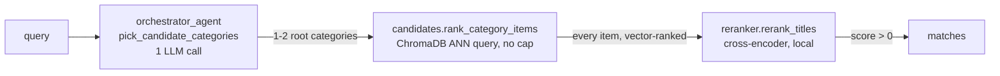
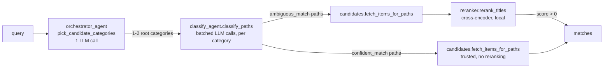

# Retrieval pipeline: two approaches, benchmarked against each other

Two competing implementations of the same job — given a free-text query (e.g. "dog
drinking bowl"), return every genuinely matching product in the catalog, not a
retrieval-size artifact capped at some arbitrary top_n. Both live in
`src/retrieval_pipeline/`, both are runnable and importable independently, and
`evaluator/comparison.py` runs them both against the same queries to measure which one
actually wins on precision/recall/f1/latency/cost.

`src/agent_pipeline/chat_engine.py` (the live chat product) is wired into this pipeline:
a concept-narrowed query is routed through `main_1` ("simple") or `main_2` ("structured")
based on a `mode` the user picks in the UI, never Claude — see the README's "Retrieval
Mode Selection" section for the full wiring. Broad category browsing (no concept) still
bypasses this pipeline entirely with a direct ChromaDB fetch, since there's no query to
rank or classify against.

## Approach 1 — `main_1.py`, "simple" (rank + rerank)



One LLM call picks 1-2 root categories, then **every** item in those categories is
vector-ranked (ChromaDB ANN query, `n_results` = full category count — never an
arbitrary cap) and cross-encoder reranked directly against the query. `score > 0` is the
final match/no-match line.

| File | Role |
|---|---|
| `orchestrator_agent.py` | 1 LLM call: picks up to `MAX_CANDIDATES` root categories worth searching |
| `candidates.py` (`rank_category_items`) | ChromaDB ANN query over the picked categories, ranked by cosine similarity, no truncation |
| `reranker.py` | Cross-encoder (`ms-marco-MiniLM-L-6-v2`) scores every (query, title) pair; `score > 0` = match |
| `main_1.py` | Wires the three together, saves output, tracks latency/cost |

Cheap and fast (one LLM call total), but expected to lose precision on broad root
categories where the query concept is a small slice of a large catalog — nothing narrows
the pool before the reranker sees it.

## Approach 2 — `main_2.py`, "structured" (classify + rerank residual)



Same orchestrator step, but instead of reranking everything, `classify_agent` scores
every **real** Amazon `category_path` under each picked root category against the query
and splits them into `confident_match` (trusted as an exact filter, no title-reading),
`ambiguous_match` (could hold both matching and non-matching items — handed to the
reranker), and `not_match` (dropped). Only the ambiguous residual gets reranked.

| File | Role |
|---|---|
| `orchestrator_agent.py` | Same 1 LLM call as approach 1 |
| `classify_agent.py` | 1+ batched LLM calls per category: scores every real `category_path` into confident/ambiguous/not_match |
| `candidates.py` (`fetch_items_for_paths`) | Exact ChromaDB filter by `category_path` — used for both confident items (trusted) and ambiguous items (sent to reranker) |
| `reranker.py` | Same cross-encoder, only run on the ambiguous residual |
| `main_2.py` | Wires it together, saves output, tracks latency/cost |

More expensive (one classify_paths call per candidate category, each itself a batched
multi-call LLM pass over every *distinct* `category_path` in that category — not every
item; e.g. Pet Supplies has 681 items but only 166 distinct paths, Home & Kitchen has
5,354 items but only 629 distinct paths) but expected to win on precision/recall when a
real `category_path` exists that cleanly identifies the query concept.

## Shared infrastructure

| File | Role |
|---|---|
| `llm_client.py` | Single DeepSeek client, wrapped once with LangSmith's `wrap_openai` so every LLM call from any agent lands in the same trace tree; also a thread-safe token-usage/cost accumulator (`reset_usage()` / `get_usage()`) that both mains read after a run |
| `build_chroma.py` | Builds/updates the ChromaDB collection (`title_embedding_db`) both approaches query against — not part of either approach's request-time path |

Every LLM call in both approaches goes through `llm_client.client` (wrapped for
LangSmith tracing) and calls `record_usage(resp)` right after, so
`evaluator/comparison.py` can read exact token counts and $ cost per run without either
main computing it separately.

## Output schema

Both mains save their run to `data/processed/pipeline_runs/{simple,structured}__{query}.json`
and return the same dict shape:

```json
{
  "query": "...",
  "approach": "simple | structured",
  "categories": [...],
  "titles_found_count": 681,
  "match_count": 21,
  "titles_found": [
    {"asin": "...", "title": "...", "rerank_score": 4.2, "is_match": true, ...}
  ],
  "latency_s": {"...": "...", "total": 10.3},
  "usage": {"calls": 1, "estimated_cost_usd": 0.0001, ...}
}
```

`titles_found` records **every** title considered, not just matches — same schema as
`evaluator/golden_dataset.json`, so `evaluator/metrics.py` can score either output
directly by comparing `is_match=true` ASIN sets.

## Evaluation

| File | Role |
|---|---|
| `evaluator/golden_dataset.json` | Hand-verified ground truth for 20 queries (13 `verified`, 6 `reconciled`, 1 `verified_partial`) |
| `evaluator/metrics.py` | `score_pipeline_run(output)` — precision/recall/f1 by ASIN set overlap against the matching golden_dataset.json entry |
| `evaluator/comparison.py` | Runs both mains over every verified query, scores each with `metrics.py`, aggregates, saves JSON + markdown report to `evaluator/results/` |

```bash
python -m src.retrieval_pipeline.main_1 "dog drinking bowl"
python -m src.retrieval_pipeline.main_2 "dog drinking bowl"
python -m evaluator.metrics data/processed/pipeline_runs/simple__dog_drinking_bowl.json
python -m evaluator.comparison                                    # every verified query, both approaches
python -m evaluator.comparison "dog drinking bowl" "kids costumes"  # specific queries only
```

**Caveat:** `evaluator/golden_dataset.json` entries with `status: verified_partial`
(currently only "female fitness clothes") have ground truth built from a sample, not an
exhaustive enumeration — recall against them is a lower bound, not exact. `comparison.py`
carries this status through into its output so it isn't silently averaged in as if it
were as reliable as the fully verified queries.
